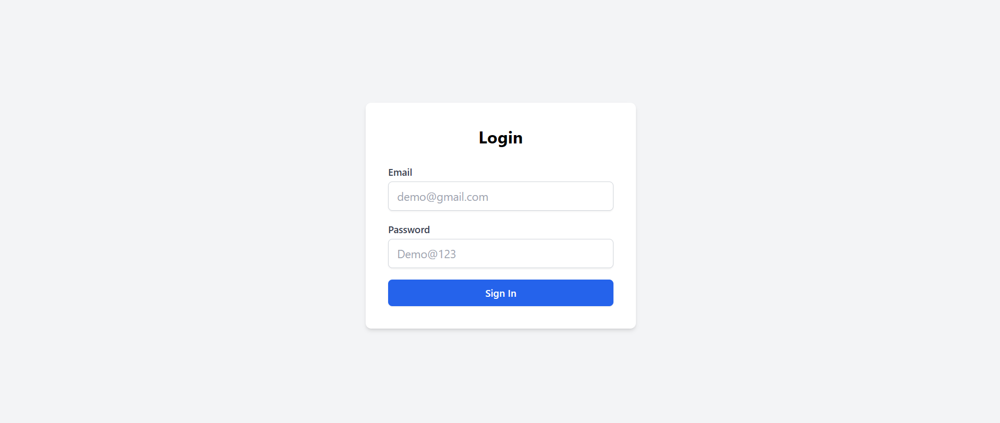
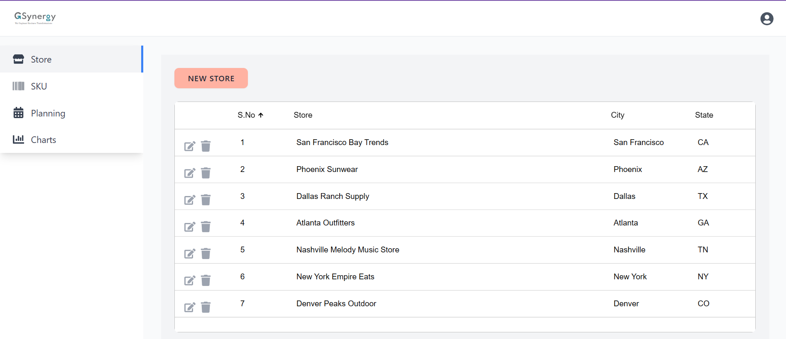
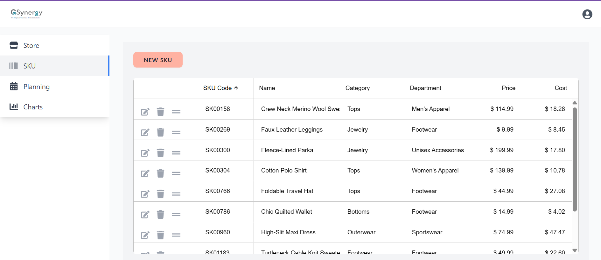
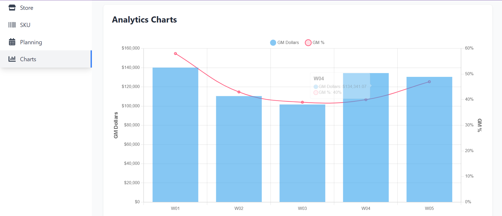

# Store Management System

A modern React-based store management system for efficient retail operations management.

## Quick Start

1. Clone the repository:
```bash
git clone <repository-url>
cd store-management-system
```

2. Install dependencies:
```bash
npm install
```

3. Start the development server:
```bash
npm start
```

The application will be available at `http://localhost:3000`

## Application Flow

### 1. Authentication


To access the system, use the demo credentials:
```
Email: demo@gmail.com
Password: Demo@123
```

The login page features:
- Secure authentication with error handling
- Password visibility toggle
- Responsive design for all devices

### 2. Store Management


Efficiently manage store operations:
- View all stores in an interactive grid
- Add new stores with location and metrics
- Edit store details with inline editing
- Delete stores with confirmation
- Track GM% with conditional formatting
- Sort and filter store data

### 3. SKU Management


Complete SKU lifecycle management:
- Comprehensive SKU database with grid view
- Categories: Tops, Bottoms, Outerwear, etc.
- Price and cost tracking
- Automatic GM calculations
- SKU code generation

### 4. Planning Dashboard


Weekly planning and tracking:
- Week-by-week performance view
- Sales and GM tracking
- Historical data comparison
- Performance metrics visualization

### 5. Analytics


Interactive data visualization:
- Mixed bar and line charts
- GM Dollars trend (Bar chart)
- GM Percentage overlay (Line chart)
- Weekly performance comparison
- Interactive tooltips
- Custom date range selection

## Tech Stack

- **Frontend**: React 18 with TypeScript
- **State Management**: Redux Toolkit
- **Data Grid**: AG Grid Enterprise
- **Charts**: Chart.js with react-chartjs-2
- **Styling**: Tailwind CSS
- **Types**: TypeScript typing

## Project Structure

```
src/
├── pages/              # Main page components
│   ├── Login.tsx      # Authentication page
│   ├── Store.tsx      # Store management
│   ├── SKU.tsx        # SKU operations
│   ├── Planning.tsx   # Planning dashboard
│   └── Charts.tsx     # Analytics
├── redux/             # State management
│   └── slices/        # Redux slices
│       ├── authSlice.ts
│       ├── storeSlice.ts
│       └── skuSlice.ts
├── styles/            # CSS and Tailwind
│   └── ag-grid-custom.css
└── types/             # TypeScript definitions
    ├── Store.ts
    └── Sku.ts
```

## Development

The application uses:
- Modern React practices with hooks
- TypeScript for type safety
- Redux Toolkit for state management
- AG Grid for powerful data management
- Chart.js for analytics visualization
- Tailwind CSS for responsive design

Note: Screenshots will be added to showcase the key features of each page. The application is designed to be intuitive and user-friendly, with a focus on efficiency and data accuracy.
